# Forge Features

Complete reference for all Forge capabilities (v2.0.0).

---

## Core Features

### Formula Evaluation

- **Row-wise formulas**: `=revenue - expenses` (applies to each row)
- **Aggregation formulas**: `=SUM(revenue)`, `=AVERAGE(profit)`
- **Cross-table references**: `=pl_2025.revenue`
- **Array indexing**: `revenue[3]`
- **Nested functions**: `=ROUND(SQRT(revenue), 2)`

### 57+ Excel-Compatible Functions



```mermaid
graph LR
    subgraph Aggregation
        A[SUM] --> B[AVERAGE]
        B --> C[MAX/MIN]
        C --> D[COUNT]
        D --> E[PRODUCT]
    end

    subgraph Conditional
        F[SUMIF] --> G[COUNTIF]
        G --> H[AVERAGEIF]
        H --> I[SUMIFS/COUNTIFS]
        I --> J[MAXIFS/MINIFS]
    end

    subgraph Lookup
        K[INDEX] --> L[MATCH]
        L --> M[XLOOKUP]
        M --> N[VLOOKUP]
    end

    subgraph Financial
        O[NPV] --> P[IRR]
        P --> Q[PMT/FV/PV]
        Q --> R[RATE/NPER]
    end

    subgraph Math
        S[ROUND] --> T[CEILING/FLOOR]
        T --> U[MOD/SQRT/POWER]
    end

    subgraph Text
        V[CONCAT] --> W[TRIM]
        W --> X[UPPER/LOWER]
        X --> Y[LEN/MID]
    end

    subgraph Date
        Z[TODAY] --> AA[DATE]
        AA --> AB[YEAR/MONTH/DAY]
    end
```

**v1.6.0 Financial Functions (7 new):**

| Function | Description | Example |
|----------|-------------|---------|
| `NPV(rate, values)` | Net Present Value | `=NPV(0.1, cash_flows)` |
| `IRR(values)` | Internal Rate of Return | `=IRR(cash_flows)` |
| `PMT(rate, nper, pv)` | Payment calculation | `=PMT(0.05/12, 360, 200000)` |
| `FV(rate, nper, pmt)` | Future Value | `=FV(0.08, 10, -1000)` |
| `PV(rate, nper, pmt)` | Present Value | `=PV(0.06, 5, -1000)` |
| `RATE(nper, pmt, pv)` | Interest rate finder | `=RATE(360, -1000, 200000)` |
| `NPER(rate, pmt, pv)` | Number of periods | `=NPER(0.05/12, -500, 20000)` |

**v1.2.0 Lookup Functions (4):**

- INDEX, MATCH, XLOOKUP, VLOOKUP

**v1.1.0 Functions (27):**

- Conditional: SUMIF, COUNTIF, AVERAGEIF, SUMIFS, COUNTIFS, AVERAGEIFS, MAXIFS, MINIFS
- Math: ROUND, ROUNDUP, ROUNDDOWN, CEILING, FLOOR, MOD, SQRT, POWER
- Text: CONCAT, TRIM, UPPER, LOWER, LEN, MID, REPT
- Date: TODAY, DATE, YEAR, MONTH, DAY

**v1.0.0 Functions:**

- Aggregation: SUM, AVERAGE, MAX, MIN, COUNT, PRODUCT
- Logical: IF, AND, OR, NOT, XOR
- Math: ABS

---

## Enterprise Features (v2.0.0)

### HTTP REST API Server

Run `forge-server` for production HTTP API:

```bash
forge-server --host 0.0.0.0 --port 8080
```

**Endpoints:**

| Endpoint | Method | Description |
|----------|--------|-------------|
| `/api/v1/validate` | POST | Validate YAML models |
| `/api/v1/calculate` | POST | Calculate formulas |
| `/api/v1/audit` | POST | Audit variable dependencies |
| `/api/v1/export` | POST | Export to Excel |
| `/api/v1/import` | POST | Import from Excel |
| `/health` | GET | Health check |
| `/version` | GET | Server version |

**Example:**

```bash
curl -X POST http://localhost:8080/api/v1/validate \
  -H "Content-Type: application/json" \
  -d '{"file_path": "model.yaml"}'
```

**Response:**

```json
{
  "success": true,
  "request_id": "550e8400-e29b-41d4-a716-446655440000",
  "data": {
    "valid": true,
    "file_path": "model.yaml",
    "message": "Validation successful"
  }
}
```

---

## Monte Carlo Simulation (v8.0.0) - Enterprise Only

Probabilistic FP&A analysis with uncertainty quantification.

### Overview

Run thousands of simulations to understand the range of possible outcomes for your financial models. Replace single-point estimates with probability distributions.

**Configuration:**

```yaml
monte_carlo:
  enabled: true
  iterations: 10000          # Number of simulations
  sampling: latin_hypercube  # or 'random'
  seed: 12345               # Optional: for reproducibility
  outputs:
    - variable: valuation.npv
      percentiles: [10, 50, 90]
      thresholds: [0, 100000]
```

### Probability Distributions

| Distribution | Function | Parameters | Use Case |
|--------------|----------|------------|----------|
| Normal | `MC.Normal(mean, std_dev)` | mean, standard deviation | Revenue growth, cost variations |
| Triangular | `MC.Triangular(min, mode, max)` | minimum, most likely, maximum | Project costs with best/worst/likely |
| Uniform | `MC.Uniform(min, max)` | minimum, maximum | Equal probability across range |
| PERT | `MC.PERT(min, mode, max)` | minimum, most likely, maximum | Three-point estimates (β distribution) |
| Lognormal | `MC.Lognormal(mean, std_dev)` | mean, standard deviation | Stock prices, multiplicative processes |

### Output Metrics

**Percentiles**: Understand outcome distribution
```yaml
outputs:
  - variable: valuation.npv
    percentiles: [10, 50, 90]  # P10, median, P90
```

**Probability Thresholds**: Risk quantification
```yaml
outputs:
  - variable: valuation.npv
    thresholds: [0, 100000]  # P(NPV > 0), P(NPV > 100K)
```

**Sensitivity Analysis**: Variable importance ranking
```yaml
outputs:
  - variable: valuation.npv
    sensitivity: true  # Correlation coefficients
```

### Example Usage

**Command:**

```bash
forge monte-carlo model.yaml --output results.yaml
```

**Input Model:**

```yaml
_forge_version: "5.0.0"

monte_carlo:
  enabled: true
  iterations: 10000
  sampling: latin_hypercube
  seed: 12345
  outputs:
    - variable: valuation.npv
      percentiles: [10, 50, 90]
      thresholds: [0, 100000]
      sensitivity: true

assumptions:
  revenue_growth: =MC.Normal(0.15, 0.05)
  initial_cost: =MC.Triangular(80000, 100000, 150000)
  discount_rate: =MC.Uniform(0.08, 0.12)

cash_flows:
  year: [0, 1, 2, 3, 4, 5]
  revenue: [0, 100000, 110000, 120000, 130000, 140000]
  costs: "=IF(year = 0, assumptions.initial_cost, revenue * 0.6)"
  net_cf: "=revenue - costs"

valuation:
  npv: =NPV(assumptions.discount_rate, cash_flows.net_cf)
```

**Output:**

```yaml
monte_carlo_results:
  valuation.npv:
    percentiles:
      p10: -12450.23
      p50: 45678.91
      p90: 98234.56
    thresholds:
      "0": 0.73        # 73% probability NPV > 0
      "100000": 0.12   # 12% probability NPV > 100K
    sensitivity:
      assumptions.revenue_growth: 0.85
      assumptions.initial_cost: -0.62
      assumptions.discount_rate: -0.43
    statistics:
      mean: 46123.45
      std_dev: 32456.78
      min: -45678.12
      max: 145678.90
```

### Sampling Methods

**Latin Hypercube Sampling (Recommended)**:
- More efficient convergence
- Better coverage of probability space
- Preferred for <50K iterations

**Random Sampling**:
- Simple Monte Carlo
- Requires more iterations
- Use for >100K iterations

### Performance

| Iterations | Variables | Time | Notes |
|------------|-----------|------|-------|
| 1,000 | 20 | <1s | Quick analysis |
| 10,000 | 20 | <5s | Standard analysis |
| 100,000 | 20 | <30s | High precision |
| 1,000,000 | 20 | <5min | Research-grade |

**License**: Monte Carlo simulation requires Forge Enterprise license.

---

## AI Integration (v1.7.0)

### MCP Server

Model Context Protocol server for AI agents:

```bash
forge-mcp  # Runs JSON-RPC over stdin/stdout
```

**Claude Desktop Configuration:**

```json
{
  "mcpServers": {
    "forge": {
      "command": "forge-mcp"
    }
  }
}
```

**Available Tools:**

- `forge_validate` - Validate YAML models
- `forge_calculate` - Calculate formulas
- `forge_audit` - Audit dependencies
- `forge_export` - Export to Excel
- `forge_import` - Import from Excel

---

## Developer Tools (v1.4.0-v1.5.0)

### Watch Mode

Real-time file monitoring:

```bash
forge watch model.yaml           # Watch single file
forge watch .                    # Watch all YAML files
forge watch model.yaml --calculate  # Auto-calculate on save
```

### Audit Trail

Dependency chain visualization:

```bash
forge audit model.yaml total_profit
```

Output:

```
Audit trail for 'total_profit':

total_profit
├── =revenue - expenses
├── revenue (from: pl_2025)
│   └── [100000, 120000, 150000]
└── expenses (from: pl_2025)
    └── [80000, 90000, 100000]

Calculated value: [20000, 30000, 50000]
```

---

## Excel Integration

### Export (`forge export`)

```bash
forge export model.yaml output.xlsx
```

- YAML tables → Excel worksheets
- Formulas preserved and translated
- Cross-table references → Sheet references

### Import (`forge import`)

```bash
forge import spreadsheet.xlsx output.yaml
```

- Excel worksheets → YAML tables
- Formulas reverse-translated
- Round-trip verified

---

## Type System

**Column Types:**

| Type | Example | Notes |
|------|---------|-------|
| Numbers | `[100, 200, 300]` | f64 precision |
| Text | `["Q1", "Q2", "Q3"]` | UTF-8 strings |
| Dates | `["2025-01", "2025-02"]` | YYYY-MM format |
| Booleans | `[true, false, true]` | Logical values |

**Type Safety:**

- Homogeneous arrays (no mixed types)
- Compile-time validation
- Rust memory safety guarantees

---

## Performance

| Operation | Time | Notes |
|-----------|------|-------|
| Validation | <200ms | 850 formulas |
| Calculation | <200ms | Complex models |
| Export | <500ms | 10 worksheets |
| Import | <500ms | 10 worksheets |

**Zero tokens**: All operations run locally.

---

## CI/CD Integration

### GitHub Action

```yaml
name: Validate Models
on: [push, pull_request]

jobs:
  validate:
    runs-on: ubuntu-latest
    steps:
      - uses: actions/checkout@v4
      - uses: royalbit/forge/.github/actions/validate@main
        with:
          files: "models/*.yaml"
```

---

## CLI Reference

```bash
forge validate <files...>       # Validate YAML model(s) - supports multiple files
forge calculate <file>          # Calculate formulas
forge calculate <file> --dry-run  # Preview without saving
forge audit <file> <variable>   # Show dependency chain
forge export <yaml> <xlsx>      # Export to Excel
forge import <xlsx> <yaml>      # Import from Excel
forge watch <path>              # Watch for changes
forge-mcp                       # Start MCP server
forge-server                    # Start HTTP API server
```

**v4.2.1 Updates:**
- Multi-file validation: `forge validate file1.yaml file2.yaml`
- COUNT function works on any column type (not just numeric)

---

For full documentation, see [README.md](../README.md)
