# Forge Features

Complete reference for all Forge capabilities (v10.0.0).

---

## Core Features

### Formula Evaluation

- **Row-wise formulas**: `=revenue - expenses` (applies to each row)
- **Aggregation formulas**: `=SUM(revenue)`, `=AVERAGE(profit)`
- **Cross-table references**: `=pl_2025.revenue`
- **Array indexing**: `revenue[3]`
- **Nested functions**: `=ROUND(SQRT(revenue), 2)`

### 173 Excel-Compatible Functions

```mermaid
graph LR
    subgraph Aggregation
        A[SUM] --> B[AVERAGE]
        B --> C[MAX/MIN]
        C --> D[COUNT]
        D --> E[PRODUCT]
    end

    subgraph Conditional
        F[SUMIF] --> G[COUNTIF]
        G --> H[AVERAGEIF]
        H --> I[SUMIFS/COUNTIFS]
        I --> J[MAXIFS/MINIFS]
    end

    subgraph Lookup
        K[INDEX] --> L[MATCH]
        L --> M[XLOOKUP]
        M --> N[VLOOKUP]
    end

    subgraph Financial
        O[NPV] --> P[IRR]
        P --> Q[PMT/FV/PV]
        Q --> R[RATE/NPER]
    end

    subgraph Math
        S[ROUND] --> T[CEILING/FLOOR]
        T --> U[MOD/SQRT/POWER]
    end

    subgraph Text
        V[CONCAT] --> W[TRIM]
        W --> X[UPPER/LOWER]
        X --> Y[LEN/MID]
    end

    subgraph Date
        Z[TODAY] --> AA[DATE]
        AA --> AB[YEAR/MONTH/DAY]
    end
```



**v1.6.0 Financial Functions (7 new):**

| Function | Description | Example |
|----------|-------------|---------|
| `NPV(rate, values)` | Net Present Value | `=NPV(0.1, cash_flows)` |
| `IRR(values)` | Internal Rate of Return | `=IRR(cash_flows)` |
| `PMT(rate, nper, pv)` | Payment calculation | `=PMT(0.05/12, 360, 200000)` |
| `FV(rate, nper, pmt)` | Future Value | `=FV(0.08, 10, -1000)` |
| `PV(rate, nper, pmt)` | Present Value | `=PV(0.06, 5, -1000)` |
| `RATE(nper, pmt, pv)` | Interest rate finder | `=RATE(360, -1000, 200000)` |
| `NPER(rate, pmt, pv)` | Number of periods | `=NPER(0.05/12, -500, 20000)` |

**v1.2.0 Lookup Functions (4):**

- INDEX, MATCH, XLOOKUP, VLOOKUP

**v1.1.0 Functions (27):**

- Conditional: SUMIF, COUNTIF, AVERAGEIF, SUMIFS, COUNTIFS, AVERAGEIFS, MAXIFS, MINIFS
- Math: ROUND, ROUNDUP, ROUNDDOWN, CEILING, FLOOR, MOD, SQRT, POWER
- Text: CONCAT, TRIM, UPPER, LOWER, LEN, MID, REPT
- Date: TODAY, DATE, YEAR, MONTH, DAY

**v1.0.0 Functions:**

- Aggregation: SUM, AVERAGE, MAX, MIN, COUNT, PRODUCT
- Logical: IF, AND, OR, NOT, XOR
- Math: ABS

---

## API & Server Features

### HTTP REST API Server

Run `forge-server` for production HTTP API:

```bash
forge-server --host 0.0.0.0 --port 8080
```

**Endpoints:**

| Endpoint | Method | Description |
|----------|--------|-------------|
| `/api/v1/validate` | POST | Validate YAML models |
| `/api/v1/calculate` | POST | Calculate formulas |
| `/api/v1/audit` | POST | Audit variable dependencies |
| `/api/v1/export` | POST | Export to Excel |
| `/api/v1/import` | POST | Import from Excel |
| `/health` | GET | Health check |
| `/version` | GET | Server version |

**Example:**

```bash
curl -X POST http://localhost:8080/api/v1/validate \
  -H "Content-Type: application/json" \
  -d '{"file_path": "model.yaml"}'
```

**Response:**

```json
{
  "success": true,
  "request_id": "550e8400-e29b-41d4-a716-446655440000",
  "data": {
    "valid": true,
    "file_path": "model.yaml",
    "message": "Validation successful"
  }
}
```

---

## Monte Carlo Simulation (v8.0.0)

Probabilistic FP&A analysis with uncertainty quantification.

### Overview

Monte Carlo simulation enables risk-aware financial planning by running thousands of simulations to understand the full range of possible outcomes. Instead of single-point forecasts, model uncertainty with probability distributions and quantify risks.

**Why Monte Carlo for FP&A:**
- Quantify uncertainty in revenue, costs, and cash flows
- Calculate probability of meeting financial targets
- Identify key risk drivers through sensitivity analysis
- Support better decision-making with confidence intervals
- Replace "best/worst/base case" with full probability distributions

**Configuration:**

```yaml
monte_carlo:
  enabled: true
  iterations: 10000          # Number of simulations (1K-1M)
  sampling: latin_hypercube  # or 'monte_carlo'
  seed: 12345               # Optional: for reproducibility
  outputs:
    - variable: valuation.npv
      percentiles: [10, 50, 90]
      thresholds: [0, 100000]
      sensitivity: true
      histogram: true         # Generate histogram data
```

### Probability Distributions

All six supported distributions for modeling uncertainty:

| Distribution | Function | Parameters | Use Case |
|--------------|----------|------------|----------|
| Normal | `MC.Normal(mean, std_dev)` | mean, standard deviation | Revenue growth rates, cost variations |
| Triangular | `MC.Triangular(min, mode, max)` | minimum, most likely, maximum | Project costs with best/worst/likely estimates |
| Uniform | `MC.Uniform(min, max)` | minimum, maximum | Equal probability across range |
| PERT | `MC.PERT(min, mode, max)` | minimum, most likely, maximum | Three-point estimates (smoother than Triangular) |
| Lognormal | `MC.Lognormal(mean, std_dev)` | mean, standard deviation | Stock prices, asset values, multiplicative growth |
| Discrete | `MC.Discrete(values, probabilities)` | values array, probabilities array | Scenarios with specific outcomes |

**Examples:**

```yaml
assumptions:
  # Normal: Continuous symmetric distribution
  revenue_growth: =MC.Normal(0.15, 0.05)  # 15% mean, 5% std dev

  # Triangular: Three-point estimate
  project_cost: =MC.Triangular(80000, 100000, 150000)

  # Uniform: All values equally likely
  discount_rate: =MC.Uniform(0.08, 0.12)

  # PERT: Smoother three-point (beta distribution)
  contract_value: =MC.PERT(200000, 250000, 400000)

  # Lognormal: Right-skewed, positive values only
  customer_ltv: =MC.Lognormal(5000, 1500)

  # Discrete: Specific scenarios with probabilities
  market_outcome: =MC.Discrete([0.05, 0.15, 0.25], [0.2, 0.5, 0.3])
  # 20% chance of 5%, 50% chance of 15%, 30% chance of 25%
```

### Output Statistics

Monte Carlo simulations generate comprehensive statistics for each tracked variable:

**Core Statistics:**
- `mean`: Expected value across all simulations
- `median`: Middle value (50th percentile)
- `std_dev`: Standard deviation (volatility measure)
- `min`: Minimum value observed
- `max`: Maximum value observed

**Percentiles**: Understand the distribution of outcomes
```yaml
outputs:
  - variable: valuation.npv
    percentiles: [10, 25, 50, 75, 90, 95, 99]  # Custom percentile levels
```

**Probability Thresholds**: Answer "what's the probability of X?"
```yaml
outputs:
  - variable: valuation.npv
    thresholds: [0, 100000, 500000]
    # Returns: P(NPV > 0), P(NPV > 100K), P(NPV > 500K)
```

**Histograms**: Visualize outcome distribution
```yaml
outputs:
  - variable: valuation.npv
    histogram: true
    bins: 50  # Number of histogram bins (default: 50)
```

**Sensitivity Analysis**: Identify key drivers
```yaml
outputs:
  - variable: valuation.npv
    sensitivity: true  # Correlation coefficients for each input
```

### Correlation

Model relationships between uncertain variables using correlation coefficients:

```yaml
monte_carlo:
  enabled: true
  iterations: 10000
  sampling: latin_hypercube

  # Define correlated variables
  correlations:
    - variables: [assumptions.revenue_growth, assumptions.market_growth]
      coefficient: 0.85  # Strong positive correlation

    - variables: [assumptions.oil_price, assumptions.energy_cost]
      coefficient: 0.70  # Moderate positive correlation

    - variables: [assumptions.interest_rate, assumptions.bond_price]
      coefficient: -0.90  # Strong negative correlation

assumptions:
  revenue_growth: =MC.Normal(0.15, 0.05)
  market_growth: =MC.Normal(0.12, 0.04)
  oil_price: =MC.Lognormal(80, 15)
  energy_cost: =MC.Normal(50000, 10000)
  interest_rate: =MC.Uniform(0.03, 0.08)
  bond_price: =MC.Normal(100, 5)
```

**Correlation Guidelines:**
- Coefficient range: -1.0 (perfect negative) to +1.0 (perfect positive)
- 0.0 = no correlation (independent variables)
- Use domain knowledge to identify relationships
- Correlations are preserved using Gaussian copula transformation

### Example: Revenue Simulation

Complete revenue forecasting model with Monte Carlo uncertainty quantification.

**Command:**

```bash
forge monte-carlo revenue_forecast.yaml --output results.yaml
```

**Input Model (`revenue_forecast.yaml`):**

```yaml
_forge_version: "5.0.0"

monte_carlo:
  enabled: true
  iterations: 10000
  sampling: latin_hypercube
  seed: 42

  # Model correlations between market and company performance
  correlations:
    - variables: [assumptions.market_growth, assumptions.revenue_growth]
      coefficient: 0.75  # Revenue correlated with market

  outputs:
    - variable: forecast.total_revenue
      percentiles: [10, 25, 50, 75, 90]
      thresholds: [1000000, 1200000, 1500000]
      sensitivity: true
      histogram: true

    - variable: forecast.gross_profit
      percentiles: [10, 50, 90]
      sensitivity: true

assumptions:
  # Market conditions
  market_growth: =MC.Normal(0.08, 0.03)  # 8% growth, 3% volatility

  # Revenue drivers (correlated with market)
  revenue_growth: =MC.Normal(0.12, 0.05)  # 12% growth, 5% volatility

  # Cost structure
  cogs_margin: =MC.Triangular(0.35, 0.40, 0.45)  # 35-45% COGS

  # Customer metrics
  churn_rate: =MC.Uniform(0.05, 0.15)  # 5-15% monthly churn

  # One-time events
  contract_win: =MC.Discrete([0, 250000, 500000], [0.4, 0.4, 0.2])
  # 40% no win, 40% medium win, 20% large win

baseline:
  starting_revenue: 800000
  customers: 1000

forecast:
  year: [1, 2, 3]

  # Revenue with growth and one-time contracts
  revenue: "=baseline.starting_revenue * POWER(1 + assumptions.revenue_growth, year) + IF(year = 1, assumptions.contract_win, 0)"

  # Costs vary with revenue
  cogs: "=revenue * assumptions.cogs_margin"

  # Gross profit
  gross_profit: "=revenue - cogs"

  # Customer retention
  retained_customers: "=baseline.customers * POWER(1 - assumptions.churn_rate, year)"

  # Total revenue across forecast period
  total_revenue: =SUM(revenue)
```

**Output (`results.yaml`):**

```yaml
monte_carlo_results:
  forecast.total_revenue:
    statistics:
      mean: 3245678.90
      median: 3198234.50
      std_dev: 487234.12
      min: 2012345.00
      max: 5234567.00

    percentiles:
      p10: 2634567.00  # 10% chance below this
      p25: 2898234.00
      p50: 3198234.50  # Median
      p75: 3567890.00
      p90: 3989234.00  # 90% chance below this

    thresholds:
      "1000000": 0.99  # 99% probability > $1M
      "1200000": 0.95  # 95% probability > $1.2M
      "1500000": 0.88  # 88% probability > $1.5M

    sensitivity:
      assumptions.revenue_growth: 0.92      # Highest impact
      assumptions.contract_win: 0.45        # Moderate impact
      assumptions.cogs_margin: -0.38        # Negative correlation
      assumptions.market_growth: 0.67       # Via correlation
      assumptions.churn_rate: -0.12         # Minor impact

    histogram:
      bins: 50
      counts: [12, 45, 89, 156, 234, ...]   # Frequency per bin
      edges: [2012345, 2076789, 2141234, ...] # Bin boundaries

  forecast.gross_profit:
    statistics:
      mean: 1947234.56
      median: 1923456.78
      std_dev: 298765.43
      min: 1123456.00
      max: 3234567.00

    percentiles:
      p10: 1567890.00
      p50: 1923456.78
      p90: 2398765.00

    sensitivity:
      assumptions.revenue_growth: 0.89
      assumptions.cogs_margin: -0.85      # Strong negative impact
      assumptions.contract_win: 0.43
      assumptions.market_growth: 0.62
      assumptions.churn_rate: -0.09
```

**Interpretation:**

- **Expected total revenue**: $3.25M with 80% confidence interval [$2.63M, $3.99M]
- **Risk assessment**: 88% probability of exceeding $1.5M revenue target
- **Key driver**: Revenue growth rate (correlation: 0.92) is the primary uncertainty
- **Cost risk**: COGS margin has strong negative correlation (-0.85) with gross profit
- **Market dependency**: Market growth indirectly affects revenue (0.67) through correlation

### Sampling Methods

**Latin Hypercube Sampling (Recommended)**:
- More efficient convergence
- Better coverage of probability space
- Preferred for <50K iterations

**Random Sampling**:
- Simple Monte Carlo
- Requires more iterations
- Use for >100K iterations

### Performance

| Iterations | Variables | Time | Notes |
|------------|-----------|------|-------|
| 1,000 | 20 | <1s | Quick analysis |
| 10,000 | 20 | <5s | Standard analysis |
| 100,000 | 20 | <30s | High precision |
| 1,000,000 | 20 | <5min | Research-grade |

**Performance**: Optimized for 10K-100K iterations with Latin Hypercube Sampling.

---

## Scenario Analysis (v8.3.0)

Evaluate discrete, mutually exclusive futures with probability-weighted outcomes.

### Overview

Scenario Analysis models strategic decision-making through distinct future states (base/bull/bear cases) with assigned probabilities. Unlike Monte Carlo's continuous distributions, scenarios represent categorical outcomes with clear business narratives.

**Why Scenario Analysis for FP&A:**
- Board-friendly presentation format with clear storylines
- Models mutually exclusive strategic futures
- Combines discrete scenarios with Monte Carlo uncertainty
- Simpler than full distributions when outcomes are categorical
- Calculates probability-weighted expected values

**Key Features:**
- Define 2-10 scenarios with probability weights (must sum to 1.0)
- Override any scalar variable per scenario
- Combine with Monte Carlo distributions within scenarios
- Calculate expected values across all scenarios
- Full integration with existing Forge models

### Configuration

```yaml
scenarios:
  base_case:
    probability: 0.50
    description: "Market grows 5%, we maintain share"
    scalars:
      revenue_growth: 0.05
      market_share: 0.20

  bull_case:
    probability: 0.30
    description: "Competitor exits, we gain market share"
    scalars:
      revenue_growth: 0.15
      market_share: 0.35

  bear_case:
    probability: 0.20
    description: "Recession, market contracts"
    scalars:
      revenue_growth: -0.10
      market_share: 0.15
```

### Combining Scenarios with Monte Carlo

Model discrete scenario branches with continuous uncertainty within each scenario:

```yaml
_forge_version: "8.3.0"

# Enable Monte Carlo for continuous uncertainty WITHIN scenarios
monte_carlo:
  enabled: true
  iterations: 10000
  sampling: latin_hypercube

scenarios:
  win_contract:
    probability: 0.60
    description: "Win the major contract"
    scalars:
      # If we win, revenue is uncertain but high
      contract_value:
        formula: "=MC.Normal(5000000, 500000)"
      customer_count:
        formula: "=MC.Triangular(800, 1000, 1200)"

  lose_contract:
    probability: 0.40
    description: "Lose to competitor"
    scalars:
      # If we lose, revenue is uncertain but lower
      contract_value:
        formula: "=MC.Normal(1000000, 200000)"
      customer_count:
        formula: "=MC.Triangular(400, 500, 600)"

forecast:
  year: [1, 2, 3]
  revenue: "=contract_value * POWER(1.05, year)"
  total_revenue: =SUM(revenue)
```

### CLI Usage

```bash
# Run scenario analysis
forge scenarios revenue_model.yaml --output results.yaml

# Compare specific scenarios
forge scenarios revenue_model.yaml --scenarios base_case,bull_case
```

### Output Format

```yaml
scenario_results:
  scenarios:
    base_case:
      probability: 0.50
      outputs:
        total_revenue: 3150000
        net_profit: 787500

    bull_case:
      probability: 0.30
      outputs:
        total_revenue: 4725000
        net_profit: 1418750

    bear_case:
      probability: 0.20
      outputs:
        total_revenue: 1890000
        net_profit: 283500

  expected_values:
    total_revenue: 3292500    # 0.5*3150K + 0.3*4725K + 0.2*1890K
    net_profit: 904125        # Probability-weighted average
```

---

## Decision Trees (v8.4.0)

Sequential decision modeling with backward induction and optimal path finding.

### Overview

Decision Trees model sequential decisions and chance events as a tree structure. The engine uses backward induction to calculate expected values at each node and identifies the optimal decision path.

**Why Decision Trees for FP&A:**
- Model sequential decisions (decide → learn → decide again)
- Find optimal decision paths automatically
- Quantify value of information and flexibility
- Clear visualization of decision logic
- Support multi-stage investment decisions

**Key Features:**
- Three node types: Decision (you control), Chance (uncertainty), Terminal (endpoints)
- Backward induction algorithm (roll back from leaves)
- Automatic optimal path identification
- Branch costs and probabilities
- DAG validation (no cycles allowed)

### Tree Structure

**Node Types:**

| Type | Description | Branches |
|------|-------------|----------|
| Decision | Choice point under your control | Choose branch with highest EV |
| Chance | Uncertain outcome | Weighted by probabilities (must sum to 1.0) |
| Terminal | End state with value | No further branches |

### Configuration

```yaml
_forge_version: "8.4.0"

decision_tree:
  name: "R&D Investment Decision"

  root:
    type: decision
    name: "Invest in R&D?"
    branches:
      invest:
        cost: 2000000        # $2M upfront investment
        next: tech_outcome
      dont_invest:
        value: 0             # Terminal: do nothing

  nodes:
    tech_outcome:
      type: chance
      name: "Technology works?"
      branches:
        success:
          probability: 0.60
          next: commercialize
        failure:
          probability: 0.40
          value: -2000000    # Lost the $2M investment

    commercialize:
      type: decision
      name: "How to commercialize?"
      branches:
        license:
          value: 5000000     # License IP for $5M
        manufacture:
          cost: 3000000      # Build factory for $3M
          value: 8000000     # Then earn $8M
```

### CLI Usage

```bash
# Analyze decision tree
forge decision-tree investment.yaml --output analysis.yaml

# Visualize tree (generates graphviz DOT format)
forge decision-tree investment.yaml --visualize tree.dot
```

### Output Format

```yaml
decision_tree_results:
  root_expected_value: 200000    # $0.2M - optimal decision value

  decision_policy:
    root: "invest"               # Optimal: Invest in R&D
    commercialize: "license"     # If successful, license (not manufacture)

  node_results:
    commercialize:
      type: decision
      expected_value: 5000000    # max($5M license, $8M-$3M manufacture) = $5M
      optimal_choice: "license"

    tech_outcome:
      type: chance
      expected_value: 2200000    # 0.6*$5M + 0.4*(-$2M) = $2.2M

    root:
      type: decision
      expected_value: 200000     # max($2.2M - $2M invest, $0 don't) = $0.2M
      optimal_choice: "invest"
```

**Interpretation:**
- Expected value of investing: $0.2M (positive, should proceed)
- Optimal strategy: Invest $2M, then license if successful
- Manufacturing is suboptimal due to $3M additional cost
- Value of R&D program: $200K after accounting for failure risk

---

## Real Options (v8.5.0)

Value managerial flexibility using financial options theory.

### Overview

Real Options Analysis values the flexibility to make future decisions (defer, expand, contract, abandon, switch). Based on Black-Scholes and binomial tree methods, it quantifies the value of strategic optionality.

**Why Real Options for FP&A:**
- Traditional NPV assumes you're locked in - Real Options values flexibility
- Quantifies value of waiting for uncertainty to resolve
- Models staged investments and reversible decisions
- Captures upside from expansion options
- Values downside protection from abandonment rights

**Key Features:**
- Six option types: Defer, Expand, Contract, Abandon, Switch, Compound
- Three valuation methods: Black-Scholes, Binomial Tree, Monte Carlo
- Models volatility and time value explicitly
- Supports American and European exercise styles
- Integrates with Monte Carlo uncertainty

### Option Types

| Option | Description | Example | Value Driver |
|--------|-------------|---------|--------------|
| Defer | Wait before investing | Wait 2 years for market clarity | Uncertainty resolution |
| Expand | Scale up if successful | Build Phase 2 after Phase 1 | Upside capture |
| Contract | Scale down if weak | Reduce capacity in downturn | Downside protection |
| Abandon | Exit and recover salvage | Sell assets if project fails | Loss limitation |
| Switch | Change inputs/outputs | Switch fuel types based on prices | Operational flexibility |
| Compound | Option on option | Pilot project before full rollout | Staged learning |

### Configuration

```yaml
_forge_version: "8.5.0"

real_options:
  name: "Factory Investment"
  method: binomial              # or 'black_scholes', 'monte_carlo'
  binomial_steps: 100           # Granularity for binomial tree
  seed: 12345                   # For Monte Carlo reproducibility

  # Underlying asset (the project without flexibility)
  underlying:
    current_value: 10000000     # $10M PV of expected cash flows
    volatility: 0.30            # 30% annual volatility
    risk_free_rate: 0.05        # 5% risk-free rate
    time_horizon: 3.0           # 3-year decision window
    dividend_yield: 0.02        # 2% continuous cash yield

  # Options to value
  options:
    - type: defer
      name: "Wait up to 2 years before building"
      max_deferral: 2.0         # Can wait up to 2 years
      exercise_cost: 8000000    # $8M to build if we proceed

    - type: expand
      name: "Double capacity if demand exceeds forecast"
      expansion_factor: 2.0     # 2x scale-up
      exercise_cost: 12000000   # $12M to expand

    - type: abandon
      name: "Sell assets if project fails"
      salvage_value: 3000000    # $3M salvage value
```

### Valuation Methods

**Black-Scholes** (Closed-form, fastest):
- European options only (exercise at expiration)
- Continuous distributions
- Best for: Simple defer/abandon options

**Binomial Tree** (Default, flexible):
- American options (early exercise allowed)
- Path-dependent payoffs
- Best for: Most real options

**Monte Carlo** (Slowest, most flexible):
- Complex/exotic options
- Multiple state variables
- Best for: Compound options, switching

### CLI Usage

```bash
# Value real options
forge real-options factory.yaml --output valuation.yaml

# Compare methods
forge real-options factory.yaml --method black_scholes --compare
```

### Output Format

```yaml
real_options_results:
  underlying_npv: 2000000       # Traditional NPV: $10M value - $8M cost = $2M

  option_values:
    defer:
      type: defer
      value: 1200000            # Worth $1.2M to wait
      optimal_exercise_time: 1.5  # Wait 1.5 years

    expand:
      type: expand
      value: 800000             # Worth $0.8M to have expansion option

    abandon:
      type: abandon
      value: 500000             # Worth $0.5M to have exit option

  total_option_value: 2500000   # Combined option value
  expanded_npv: 4500000         # NPV + option value = $2M + $2.5M

  recommendation: "Proceed with flexible design. Value of flexibility ($2.5M) exceeds 50% of base NPV."
```

**Interpretation:**
- Traditional NPV: $2M (marginally attractive)
- Option to defer adds $1.2M (value of waiting for information)
- Expansion option adds $0.8M (value of upside capture)
- Abandonment adds $0.5M (value of downside protection)
- **Total value with flexibility: $4.5M** (much more attractive)

---

## Tornado Diagrams (v8.6.0)

One-way sensitivity analysis with visual ranking of input impact.

### Overview

Tornado Diagrams identify which input variables have the biggest impact on output variance. Visualizes sensitivity as horizontal bars sorted by magnitude, creating a "tornado" shape.

**Why Tornado Diagrams for FP&A:**
- Prioritize which assumptions to refine
- Executive-friendly visualization of key drivers
- Validate models (unexpected sensitivities indicate errors)
- Focus due diligence on high-impact variables
- Support "what matters most" conversations

**Key Features:**
- One-way sensitivity (vary one input at a time)
- Automatic ranking by impact magnitude
- Low/high range testing for each input
- Visual output format for presentations
- Integration with existing Forge models

### Configuration

```yaml
_forge_version: "8.6.0"

tornado:
  output: "valuation.npv"       # Variable to analyze
  steps: 2                      # 2 = low/high only, 3+ for gradients

  inputs:
    - name: "revenue_growth"
      low: 0.02                 # Pessimistic: 2% growth
      high: 0.08                # Optimistic: 8% growth
      base: 0.05                # Base case: 5% (optional, defaults to midpoint)

    - name: "discount_rate"
      low: 0.08
      high: 0.12

    - name: "operating_margin"
      low: 0.15
      high: 0.25

    - name: "tax_rate"
      low: 0.20
      high: 0.30

    - name: "working_capital_pct"
      low: 0.10
      high: 0.15
```

### CLI Usage

```bash
# Generate tornado analysis
forge tornado valuation.yaml --output sensitivity.yaml

# Generate visualization (ASCII art)
forge tornado valuation.yaml --visualize
```

### Output Format

```yaml
tornado_results:
  output: "valuation.npv"
  base_value: 1200000           # NPV at base case

  sensitivities:
    - variable: "revenue_growth"
      base: 0.05
      low_value: 750000         # NPV when revenue_growth = 0.02
      high_value: 1650000       # NPV when revenue_growth = 0.08
      swing: 450000             # (1650K - 750K) / 2 = impact range

    - variable: "discount_rate"
      base: 0.10
      low_value: 1520000        # NPV when rate = 0.08
      high_value: 880000        # NPV when rate = 0.12
      swing: 320000

    - variable: "operating_margin"
      base: 0.20
      low_value: 1020000
      high_value: 1380000
      swing: 180000

    - variable: "tax_rate"
      base: 0.25
      low_value: 1275000
      high_value: 1125000
      swing: 75000

    - variable: "working_capital_pct"
      base: 0.125
      low_value: 1240000
      high_value: 1160000
      swing: 40000
```

### Visualization

```
NPV Sensitivity Analysis (Base: $1.2M)

Revenue Growth    |████████████████████| ± $450K
Discount Rate     |██████████████      | ± $320K
Operating Margin  |██████████          | ± $180K
Tax Rate          |████                | ± $75K
Working Capital   |██                  | ± $40K
```

**Interpretation:**
- Revenue growth drives 70% of NPV variance
- Focus forecasting effort on revenue and discount rate
- Tax rate and working capital have minimal impact
- Model is most sensitive to top-line assumptions

---

## Bootstrap Resampling (v8.7.0)

Non-parametric confidence intervals from historical data.

### Overview

Bootstrap Resampling generates confidence intervals by resampling from historical data with replacement. Unlike Monte Carlo (which assumes distributions), Bootstrap is non-parametric - it lets the data speak for itself.

**Why Bootstrap for FP&A:**
- No distribution assumptions required
- Works with complex, non-normal data
- Handles multimodal or fat-tailed distributions
- Validates parametric model results
- Robust to outliers and skewness

**Key Features:**
- Resamples historical data with replacement
- Computes any statistic (mean, median, percentiles, etc.)
- Generates confidence intervals
- Requires minimum 30 observations
- Reproducible with seed parameter

### Configuration

```yaml
_forge_version: "8.7.0"

bootstrap:
  iterations: 10000             # Number of bootstrap samples
  seed: 12345                   # For reproducibility
  confidence_levels: [0.90, 0.95, 0.99]
  statistic: mean               # or 'median', 'std', 'percentile'

  # Historical data to resample from
  data: [
    0.05, -0.02, 0.08, 0.03, -0.05,
    0.12, 0.01, -0.01, 0.06, 0.04,
    0.09, 0.02, -0.03, 0.07, 0.05,
    0.11, 0.03, 0.01, 0.08, -0.02,
    0.06, 0.04, 0.09, 0.02, 0.07,
    0.05, -0.01, 0.10, 0.03, 0.06
  ]
```

### Supported Statistics

| Statistic | Description | Use Case |
|-----------|-------------|----------|
| mean | Sample average | Expected value estimation |
| median | 50th percentile | Robust central tendency |
| std | Standard deviation | Volatility estimation |
| var | Variance | Risk quantification |
| percentile | Custom percentile | Tail risk analysis |
| min | Minimum value | Worst-case scenarios |
| max | Maximum value | Best-case scenarios |

### Example: Revenue Growth Bootstrap

```yaml
_forge_version: "8.7.0"

# Historical quarterly revenue growth rates (last 7.5 years)
bootstrap:
  iterations: 10000
  seed: 42
  statistic: mean
  confidence_levels: [0.90, 0.95, 0.99]

  # 30 quarters of historical growth
  data: [
    0.05, -0.02, 0.08, 0.03, -0.05,
    0.12, 0.01, -0.01, 0.06, 0.04,
    0.09, 0.02, -0.03, 0.07, 0.05,
    0.11, 0.03, 0.01, 0.08, -0.02,
    0.06, 0.04, 0.09, 0.02, 0.07,
    0.05, -0.01, 0.10, 0.03, 0.06
  ]

# Use bootstrap mean in forecast
assumptions:
  avg_growth: =BOOTSTRAP.Mean()  # References bootstrap result

forecast:
  year: [1, 2, 3]
  revenue: "=1000000 * POWER(1 + avg_growth, year)"
```

### CLI Usage

```bash
# Run bootstrap analysis
forge bootstrap historical.yaml --output results.yaml

# Compare different statistics
forge bootstrap historical.yaml --statistic median --compare
```

### Output Format

```yaml
bootstrap_results:
  statistic: mean
  iterations: 10000
  sample_size: 30

  point_estimate: 0.0433        # Sample mean of historical data

  bootstrap_distribution:
    mean: 0.0435                # Mean of bootstrap means
    std: 0.0087                 # SE of the statistic

  confidence_intervals:
    ci_90:
      lower: 0.0293             # 5th percentile
      upper: 0.0577             # 95th percentile
    ci_95:
      lower: 0.0267
      upper: 0.0603
    ci_99:
      lower: 0.0215
      upper: 0.0655

  percentiles:
    p1: 0.0201
    p5: 0.0293
    p25: 0.0375
    p50: 0.0435
    p75: 0.0495
    p95: 0.0577
    p99: 0.0669
```

**Interpretation:**
- Historical average growth: 4.3% per quarter
- 95% confidence interval: [2.7%, 6.0%]
- No distribution assumptions required
- Bootstrap SE: 0.87% (precision of the mean estimate)

---

## Bayesian Networks (v9.0.0)

Probabilistic graphical models with variable elimination inference.

### Overview

Bayesian Networks model probabilistic dependencies between variables as a directed acyclic graph (DAG). Each node represents a variable; edges represent causal relationships. The engine performs exact inference using variable elimination.

**Why Bayesian Networks for FP&A:**
- Model causal relationships between business drivers
- Update beliefs as evidence arrives
- Diagnose root causes of outcomes
- Answer "what if we observe X?" questions
- Quantify how failures cascade through the system

**Key Features:**
- Define discrete and continuous nodes
- Conditional probability tables (CPTs)
- Parent-child relationships (must be DAG)
- Variable elimination inference algorithm
- Evidence propagation and belief updating

### Network Structure

**Node Types:**

| Type | Description | Requires |
|------|-------------|----------|
| Discrete | Finite states with probabilities | States, prior or CPT |
| Continuous | Gaussian distribution | Mean, standard deviation |

**Root nodes** (no parents): Require prior probabilities
**Child nodes** (have parents): Require conditional probability tables (CPTs)

### Configuration

```yaml
_forge_version: "9.0.0"

bayesian_network:
  name: "Credit Risk Model"

  nodes:
    # Root node: Economic conditions
    economic_conditions:
      type: discrete
      states: ["good", "neutral", "bad"]
      prior: [0.3, 0.5, 0.2]    # P(good)=0.3, P(neutral)=0.5, P(bad)=0.2

    # Child node: Company revenue depends on economy
    company_revenue:
      type: discrete
      states: ["high", "medium", "low"]
      parents: ["economic_conditions"]

      # CPT: P(revenue | economic_conditions)
      cpt:
        good:     [0.6, 0.3, 0.1]   # If economy good: 60% high revenue
        neutral:  [0.3, 0.5, 0.2]   # If economy neutral: 50% medium revenue
        bad:      [0.1, 0.3, 0.6]   # If economy bad: 60% low revenue

    # Root node: Management quality (independent)
    management_quality:
      type: discrete
      states: ["strong", "weak"]
      prior: [0.7, 0.3]

    # Child node: Default probability depends on revenue and management
    default_probability:
      type: discrete
      states: ["low", "medium", "high"]
      parents: ["company_revenue", "management_quality"]

      # CPT: P(default | revenue, management)
      cpt:
        "high,strong":   [0.85, 0.12, 0.03]  # High revenue + strong mgmt → low default risk
        "high,weak":     [0.60, 0.30, 0.10]
        "medium,strong": [0.50, 0.35, 0.15]
        "medium,weak":   [0.30, 0.40, 0.30]
        "low,strong":    [0.20, 0.40, 0.40]
        "low,weak":      [0.10, 0.30, 0.60]  # Low revenue + weak mgmt → high default risk
```

### Inference Queries

```yaml
# Query 1: Unconditional probabilities
query:
  variable: "default_probability"
  # Returns: P(default = low/medium/high)

# Query 2: Conditional on evidence
query:
  variable: "default_probability"
  evidence:
    economic_conditions: "bad"
  # Returns: P(default | economy is bad)

# Query 3: Multiple evidence
query:
  variable: "default_probability"
  evidence:
    economic_conditions: "neutral"
    management_quality: "strong"
  # Returns: P(default | neutral economy, strong management)
```

### CLI Usage

```bash
# Analyze Bayesian network
forge bayesian credit_risk.yaml --output inference.yaml

# Query with evidence
forge bayesian credit_risk.yaml --query "default_probability" --evidence "economic_conditions=bad"

# Visualize network structure
forge bayesian credit_risk.yaml --visualize network.dot
```

### Output Format

```yaml
bayesian_inference_results:
  network: "Credit Risk Model"

  # Unconditional probabilities (no evidence)
  marginals:
    economic_conditions:
      good: 0.30
      neutral: 0.50
      bad: 0.20

    company_revenue:
      high: 0.37      # 0.3*0.6 + 0.5*0.3 + 0.2*0.1
      medium: 0.38    # Marginalizing over economy
      low: 0.25

    default_probability:
      low: 0.532
      medium: 0.298
      high: 0.170

  # Given evidence: "economic_conditions = bad"
  conditional_bad_economy:
    company_revenue:
      high: 0.10      # P(high revenue | bad economy) = 0.1
      medium: 0.30
      low: 0.60

    default_probability:
      low: 0.234      # Higher default risk given bad economy
      medium: 0.346
      high: 0.420     # 42% chance of high default

  # Given evidence: "economic_conditions = bad, management_quality = weak"
  conditional_bad_economy_weak_mgmt:
    default_probability:
      low: 0.180
      medium: 0.336
      high: 0.484     # 48.4% chance of high default - cascading risk!
```

**Interpretation:**
- Unconditional default risk: 17% high, 53.2% low
- Bad economy increases high default risk to 42%
- Bad economy + weak management → 48.4% high default risk
- Network captures how risks cascade through causal chain
- Can diagnose: "Given high default, what's likely cause?"

### Network Topology

```
[Economic Conditions] → [Company Revenue] → [Default Probability]
                                          ↗
         [Management Quality] ───────────
```

Root nodes influence child nodes through conditional probabilities. Evidence at any node updates beliefs throughout the network.

---

## AI Integration (v1.7.0)

### MCP Server

Model Context Protocol server for AI agents:

```bash
forge-mcp  # Runs JSON-RPC over stdin/stdout
```

**Claude Desktop Configuration:**

```json
{
  "mcpServers": {
    "forge": {
      "command": "forge-mcp"
    }
  }
}
```

**Available Tools:**

- `forge_validate` - Validate YAML models
- `forge_calculate` - Calculate formulas
- `forge_audit` - Audit dependencies
- `forge_export` - Export to Excel
- `forge_import` - Import from Excel

---

## Developer Tools (v1.4.0-v1.5.0)

### Watch Mode

Real-time file monitoring:

```bash
forge watch model.yaml           # Watch single file
forge watch .                    # Watch all YAML files
forge watch model.yaml --calculate  # Auto-calculate on save
```

### Audit Trail

Dependency chain visualization:

```bash
forge audit model.yaml total_profit
```

Output:

```
Audit trail for 'total_profit':

total_profit
├── =revenue - expenses
├── revenue (from: pl_2025)
│   └── [100000, 120000, 150000]
└── expenses (from: pl_2025)
    └── [80000, 90000, 100000]

Calculated value: [20000, 30000, 50000]
```

---

## Excel Integration

### Export (`forge export`)

```bash
forge export model.yaml output.xlsx
```

- YAML tables → Excel worksheets
- Formulas preserved and translated
- Cross-table references → Sheet references

### Import (`forge import`)

```bash
forge import spreadsheet.xlsx output.yaml
```

- Excel worksheets → YAML tables
- Formulas reverse-translated
- Round-trip verified

---

## Type System

**Column Types:**

| Type | Example | Notes |
|------|---------|-------|
| Numbers | `[100, 200, 300]` | f64 precision |
| Text | `["Q1", "Q2", "Q3"]` | UTF-8 strings |
| Dates | `["2025-01", "2025-02"]` | YYYY-MM format |
| Booleans | `[true, false, true]` | Logical values |

**Type Safety:**

- Homogeneous arrays (no mixed types)
- Compile-time validation
- Rust memory safety guarantees

---

## Performance

| Operation | Time | Notes |
|-----------|------|-------|
| Validation | <200ms | 850 formulas |
| Calculation | <200ms | Complex models |
| Export | <500ms | 10 worksheets |
| Import | <500ms | 10 worksheets |

**Zero tokens**: All operations run locally.

---

## CI/CD Integration

### GitHub Action

```yaml
name: Validate Models
on: [push, pull_request]

jobs:
  validate:
    runs-on: ubuntu-latest
    steps:
      - uses: actions/checkout@v4
      - uses: royalbit/forge/.github/actions/validate@main
        with:
          files: "models/*.yaml"
```

---

## CLI Reference

```bash
forge validate <files...>       # Validate YAML model(s) - supports multiple files
forge calculate <file>          # Calculate formulas
forge calculate <file> --dry-run  # Preview without saving
forge audit <file> <variable>   # Show dependency chain
forge export <yaml> <xlsx>      # Export to Excel
forge import <xlsx> <yaml>      # Import from Excel
forge watch <path>              # Watch for changes
forge-mcp                       # Start MCP server
forge-server                    # Start HTTP API server
```

**v4.2.1 Updates:**
- Multi-file validation: `forge validate file1.yaml file2.yaml`
- COUNT function works on any column type (not just numeric)

---

For full documentation, see [README.md](../README.md)
