# Forge Features

Complete reference for all Forge capabilities (v2.0.0).

---

## Core Features

### Formula Evaluation

- **Row-wise formulas**: `=revenue - expenses` (applies to each row)
- **Aggregation formulas**: `=SUM(revenue)`, `=AVERAGE(profit)`
- **Cross-table references**: `=pl_2025.revenue`
- **Array indexing**: `revenue[3]`
- **Nested functions**: `=ROUND(SQRT(revenue), 2)`

### 57+ Excel-Compatible Functions



```mermaid
graph LR
    subgraph Aggregation
        A[SUM] --> B[AVERAGE]
        B --> C[MAX/MIN]
        C --> D[COUNT]
        D --> E[PRODUCT]
    end

    subgraph Conditional
        F[SUMIF] --> G[COUNTIF]
        G --> H[AVERAGEIF]
        H --> I[SUMIFS/COUNTIFS]
        I --> J[MAXIFS/MINIFS]
    end

    subgraph Lookup
        K[INDEX] --> L[MATCH]
        L --> M[XLOOKUP]
        M --> N[VLOOKUP]
    end

    subgraph Financial
        O[NPV] --> P[IRR]
        P --> Q[PMT/FV/PV]
        Q --> R[RATE/NPER]
    end

    subgraph Math
        S[ROUND] --> T[CEILING/FLOOR]
        T --> U[MOD/SQRT/POWER]
    end

    subgraph Text
        V[CONCAT] --> W[TRIM]
        W --> X[UPPER/LOWER]
        X --> Y[LEN/MID]
    end

    subgraph Date
        Z[TODAY] --> AA[DATE]
        AA --> AB[YEAR/MONTH/DAY]
    end
```

**v1.6.0 Financial Functions (7 new):**

| Function | Description | Example |
|----------|-------------|---------|
| `NPV(rate, values)` | Net Present Value | `=NPV(0.1, cash_flows)` |
| `IRR(values)` | Internal Rate of Return | `=IRR(cash_flows)` |
| `PMT(rate, nper, pv)` | Payment calculation | `=PMT(0.05/12, 360, 200000)` |
| `FV(rate, nper, pmt)` | Future Value | `=FV(0.08, 10, -1000)` |
| `PV(rate, nper, pmt)` | Present Value | `=PV(0.06, 5, -1000)` |
| `RATE(nper, pmt, pv)` | Interest rate finder | `=RATE(360, -1000, 200000)` |
| `NPER(rate, pmt, pv)` | Number of periods | `=NPER(0.05/12, -500, 20000)` |

**v1.2.0 Lookup Functions (4):**

- INDEX, MATCH, XLOOKUP, VLOOKUP

**v1.1.0 Functions (27):**

- Conditional: SUMIF, COUNTIF, AVERAGEIF, SUMIFS, COUNTIFS, AVERAGEIFS, MAXIFS, MINIFS
- Math: ROUND, ROUNDUP, ROUNDDOWN, CEILING, FLOOR, MOD, SQRT, POWER
- Text: CONCAT, TRIM, UPPER, LOWER, LEN, MID, REPT
- Date: TODAY, DATE, YEAR, MONTH, DAY

**v1.0.0 Functions:**

- Aggregation: SUM, AVERAGE, MAX, MIN, COUNT, PRODUCT
- Logical: IF, AND, OR, NOT, XOR
- Math: ABS

---

## Enterprise Features (v2.0.0)

### HTTP REST API Server

Run `forge-server` for production HTTP API:

```bash
forge-server --host 0.0.0.0 --port 8080
```

**Endpoints:**

| Endpoint | Method | Description |
|----------|--------|-------------|
| `/api/v1/validate` | POST | Validate YAML models |
| `/api/v1/calculate` | POST | Calculate formulas |
| `/api/v1/audit` | POST | Audit variable dependencies |
| `/api/v1/export` | POST | Export to Excel |
| `/api/v1/import` | POST | Import from Excel |
| `/health` | GET | Health check |
| `/version` | GET | Server version |

**Example:**

```bash
curl -X POST http://localhost:8080/api/v1/validate \
  -H "Content-Type: application/json" \
  -d '{"file_path": "model.yaml"}'
```

**Response:**

```json
{
  "success": true,
  "request_id": "550e8400-e29b-41d4-a716-446655440000",
  "data": {
    "valid": true,
    "file_path": "model.yaml",
    "message": "Validation successful"
  }
}
```

---

## Monte Carlo Simulation (v8.0.0) - ENTERPRISE ONLY

Probabilistic FP&A analysis with uncertainty quantification.

### Overview

Monte Carlo simulation enables risk-aware financial planning by running thousands of simulations to understand the full range of possible outcomes. Instead of single-point forecasts, model uncertainty with probability distributions and quantify risks.

**Why Monte Carlo for FP&A:**
- Quantify uncertainty in revenue, costs, and cash flows
- Calculate probability of meeting financial targets
- Identify key risk drivers through sensitivity analysis
- Support better decision-making with confidence intervals
- Replace "best/worst/base case" with full probability distributions

**Configuration:**

```yaml
monte_carlo:
  enabled: true
  iterations: 10000          # Number of simulations (1K-1M)
  sampling: latin_hypercube  # or 'monte_carlo'
  seed: 12345               # Optional: for reproducibility
  outputs:
    - variable: valuation.npv
      percentiles: [10, 50, 90]
      thresholds: [0, 100000]
      sensitivity: true
      histogram: true         # Generate histogram data
```

### Probability Distributions

All six supported distributions for modeling uncertainty:

| Distribution | Function | Parameters | Use Case |
|--------------|----------|------------|----------|
| Normal | `MC.Normal(mean, std_dev)` | mean, standard deviation | Revenue growth rates, cost variations |
| Triangular | `MC.Triangular(min, mode, max)` | minimum, most likely, maximum | Project costs with best/worst/likely estimates |
| Uniform | `MC.Uniform(min, max)` | minimum, maximum | Equal probability across range |
| PERT | `MC.PERT(min, mode, max)` | minimum, most likely, maximum | Three-point estimates (smoother than Triangular) |
| Lognormal | `MC.Lognormal(mean, std_dev)` | mean, standard deviation | Stock prices, asset values, multiplicative growth |
| Discrete | `MC.Discrete(values, probabilities)` | values array, probabilities array | Scenarios with specific outcomes |

**Examples:**

```yaml
assumptions:
  # Normal: Continuous symmetric distribution
  revenue_growth: =MC.Normal(0.15, 0.05)  # 15% mean, 5% std dev

  # Triangular: Three-point estimate
  project_cost: =MC.Triangular(80000, 100000, 150000)

  # Uniform: All values equally likely
  discount_rate: =MC.Uniform(0.08, 0.12)

  # PERT: Smoother three-point (beta distribution)
  contract_value: =MC.PERT(200000, 250000, 400000)

  # Lognormal: Right-skewed, positive values only
  customer_ltv: =MC.Lognormal(5000, 1500)

  # Discrete: Specific scenarios with probabilities
  market_outcome: =MC.Discrete([0.05, 0.15, 0.25], [0.2, 0.5, 0.3])
  # 20% chance of 5%, 50% chance of 15%, 30% chance of 25%
```

### Output Statistics

Monte Carlo simulations generate comprehensive statistics for each tracked variable:

**Core Statistics:**
- `mean`: Expected value across all simulations
- `median`: Middle value (50th percentile)
- `std_dev`: Standard deviation (volatility measure)
- `min`: Minimum value observed
- `max`: Maximum value observed

**Percentiles**: Understand the distribution of outcomes
```yaml
outputs:
  - variable: valuation.npv
    percentiles: [10, 25, 50, 75, 90, 95, 99]  # Custom percentile levels
```

**Probability Thresholds**: Answer "what's the probability of X?"
```yaml
outputs:
  - variable: valuation.npv
    thresholds: [0, 100000, 500000]
    # Returns: P(NPV > 0), P(NPV > 100K), P(NPV > 500K)
```

**Histograms**: Visualize outcome distribution
```yaml
outputs:
  - variable: valuation.npv
    histogram: true
    bins: 50  # Number of histogram bins (default: 50)
```

**Sensitivity Analysis**: Identify key drivers
```yaml
outputs:
  - variable: valuation.npv
    sensitivity: true  # Correlation coefficients for each input
```

### Correlation

Model relationships between uncertain variables using correlation coefficients:

```yaml
monte_carlo:
  enabled: true
  iterations: 10000
  sampling: latin_hypercube

  # Define correlated variables
  correlations:
    - variables: [assumptions.revenue_growth, assumptions.market_growth]
      coefficient: 0.85  # Strong positive correlation

    - variables: [assumptions.oil_price, assumptions.energy_cost]
      coefficient: 0.70  # Moderate positive correlation

    - variables: [assumptions.interest_rate, assumptions.bond_price]
      coefficient: -0.90  # Strong negative correlation

assumptions:
  revenue_growth: =MC.Normal(0.15, 0.05)
  market_growth: =MC.Normal(0.12, 0.04)
  oil_price: =MC.Lognormal(80, 15)
  energy_cost: =MC.Normal(50000, 10000)
  interest_rate: =MC.Uniform(0.03, 0.08)
  bond_price: =MC.Normal(100, 5)
```

**Correlation Guidelines:**
- Coefficient range: -1.0 (perfect negative) to +1.0 (perfect positive)
- 0.0 = no correlation (independent variables)
- Use domain knowledge to identify relationships
- Correlations are preserved using Gaussian copula transformation

### Example: Revenue Simulation

Complete revenue forecasting model with Monte Carlo uncertainty quantification.

**Command:**

```bash
forge monte-carlo revenue_forecast.yaml --output results.yaml
```

**Input Model (`revenue_forecast.yaml`):**

```yaml
_forge_version: "5.0.0"

monte_carlo:
  enabled: true
  iterations: 10000
  sampling: latin_hypercube
  seed: 42

  # Model correlations between market and company performance
  correlations:
    - variables: [assumptions.market_growth, assumptions.revenue_growth]
      coefficient: 0.75  # Revenue correlated with market

  outputs:
    - variable: forecast.total_revenue
      percentiles: [10, 25, 50, 75, 90]
      thresholds: [1000000, 1200000, 1500000]
      sensitivity: true
      histogram: true

    - variable: forecast.gross_profit
      percentiles: [10, 50, 90]
      sensitivity: true

assumptions:
  # Market conditions
  market_growth: =MC.Normal(0.08, 0.03)  # 8% growth, 3% volatility

  # Revenue drivers (correlated with market)
  revenue_growth: =MC.Normal(0.12, 0.05)  # 12% growth, 5% volatility

  # Cost structure
  cogs_margin: =MC.Triangular(0.35, 0.40, 0.45)  # 35-45% COGS

  # Customer metrics
  churn_rate: =MC.Uniform(0.05, 0.15)  # 5-15% monthly churn

  # One-time events
  contract_win: =MC.Discrete([0, 250000, 500000], [0.4, 0.4, 0.2])
  # 40% no win, 40% medium win, 20% large win

baseline:
  starting_revenue: 800000
  customers: 1000

forecast:
  year: [1, 2, 3]

  # Revenue with growth and one-time contracts
  revenue: "=baseline.starting_revenue * POWER(1 + assumptions.revenue_growth, year) + IF(year = 1, assumptions.contract_win, 0)"

  # Costs vary with revenue
  cogs: "=revenue * assumptions.cogs_margin"

  # Gross profit
  gross_profit: "=revenue - cogs"

  # Customer retention
  retained_customers: "=baseline.customers * POWER(1 - assumptions.churn_rate, year)"

  # Total revenue across forecast period
  total_revenue: =SUM(revenue)
```

**Output (`results.yaml`):**

```yaml
monte_carlo_results:
  forecast.total_revenue:
    statistics:
      mean: 3245678.90
      median: 3198234.50
      std_dev: 487234.12
      min: 2012345.00
      max: 5234567.00

    percentiles:
      p10: 2634567.00  # 10% chance below this
      p25: 2898234.00
      p50: 3198234.50  # Median
      p75: 3567890.00
      p90: 3989234.00  # 90% chance below this

    thresholds:
      "1000000": 0.99  # 99% probability > $1M
      "1200000": 0.95  # 95% probability > $1.2M
      "1500000": 0.88  # 88% probability > $1.5M

    sensitivity:
      assumptions.revenue_growth: 0.92      # Highest impact
      assumptions.contract_win: 0.45        # Moderate impact
      assumptions.cogs_margin: -0.38        # Negative correlation
      assumptions.market_growth: 0.67       # Via correlation
      assumptions.churn_rate: -0.12         # Minor impact

    histogram:
      bins: 50
      counts: [12, 45, 89, 156, 234, ...]   # Frequency per bin
      edges: [2012345, 2076789, 2141234, ...] # Bin boundaries

  forecast.gross_profit:
    statistics:
      mean: 1947234.56
      median: 1923456.78
      std_dev: 298765.43
      min: 1123456.00
      max: 3234567.00

    percentiles:
      p10: 1567890.00
      p50: 1923456.78
      p90: 2398765.00

    sensitivity:
      assumptions.revenue_growth: 0.89
      assumptions.cogs_margin: -0.85      # Strong negative impact
      assumptions.contract_win: 0.43
      assumptions.market_growth: 0.62
      assumptions.churn_rate: -0.09
```

**Interpretation:**

- **Expected total revenue**: $3.25M with 80% confidence interval [$2.63M, $3.99M]
- **Risk assessment**: 88% probability of exceeding $1.5M revenue target
- **Key driver**: Revenue growth rate (correlation: 0.92) is the primary uncertainty
- **Cost risk**: COGS margin has strong negative correlation (-0.85) with gross profit
- **Market dependency**: Market growth indirectly affects revenue (0.67) through correlation

### Sampling Methods

**Latin Hypercube Sampling (Recommended)**:
- More efficient convergence
- Better coverage of probability space
- Preferred for <50K iterations

**Random Sampling**:
- Simple Monte Carlo
- Requires more iterations
- Use for >100K iterations

### Performance

| Iterations | Variables | Time | Notes |
|------------|-----------|------|-------|
| 1,000 | 20 | <1s | Quick analysis |
| 10,000 | 20 | <5s | Standard analysis |
| 100,000 | 20 | <30s | High precision |
| 1,000,000 | 20 | <5min | Research-grade |

**License**: Monte Carlo simulation requires Forge Enterprise license.

---

## AI Integration (v1.7.0)

### MCP Server

Model Context Protocol server for AI agents:

```bash
forge-mcp  # Runs JSON-RPC over stdin/stdout
```

**Claude Desktop Configuration:**

```json
{
  "mcpServers": {
    "forge": {
      "command": "forge-mcp"
    }
  }
}
```

**Available Tools:**

- `forge_validate` - Validate YAML models
- `forge_calculate` - Calculate formulas
- `forge_audit` - Audit dependencies
- `forge_export` - Export to Excel
- `forge_import` - Import from Excel

---

## Developer Tools (v1.4.0-v1.5.0)

### Watch Mode

Real-time file monitoring:

```bash
forge watch model.yaml           # Watch single file
forge watch .                    # Watch all YAML files
forge watch model.yaml --calculate  # Auto-calculate on save
```

### Audit Trail

Dependency chain visualization:

```bash
forge audit model.yaml total_profit
```

Output:

```
Audit trail for 'total_profit':

total_profit
├── =revenue - expenses
├── revenue (from: pl_2025)
│   └── [100000, 120000, 150000]
└── expenses (from: pl_2025)
    └── [80000, 90000, 100000]

Calculated value: [20000, 30000, 50000]
```

---

## Excel Integration

### Export (`forge export`)

```bash
forge export model.yaml output.xlsx
```

- YAML tables → Excel worksheets
- Formulas preserved and translated
- Cross-table references → Sheet references

### Import (`forge import`)

```bash
forge import spreadsheet.xlsx output.yaml
```

- Excel worksheets → YAML tables
- Formulas reverse-translated
- Round-trip verified

---

## Type System

**Column Types:**

| Type | Example | Notes |
|------|---------|-------|
| Numbers | `[100, 200, 300]` | f64 precision |
| Text | `["Q1", "Q2", "Q3"]` | UTF-8 strings |
| Dates | `["2025-01", "2025-02"]` | YYYY-MM format |
| Booleans | `[true, false, true]` | Logical values |

**Type Safety:**

- Homogeneous arrays (no mixed types)
- Compile-time validation
- Rust memory safety guarantees

---

## Performance

| Operation | Time | Notes |
|-----------|------|-------|
| Validation | <200ms | 850 formulas |
| Calculation | <200ms | Complex models |
| Export | <500ms | 10 worksheets |
| Import | <500ms | 10 worksheets |

**Zero tokens**: All operations run locally.

---

## CI/CD Integration

### GitHub Action

```yaml
name: Validate Models
on: [push, pull_request]

jobs:
  validate:
    runs-on: ubuntu-latest
    steps:
      - uses: actions/checkout@v4
      - uses: royalbit/forge/.github/actions/validate@main
        with:
          files: "models/*.yaml"
```

---

## CLI Reference

```bash
forge validate <files...>       # Validate YAML model(s) - supports multiple files
forge calculate <file>          # Calculate formulas
forge calculate <file> --dry-run  # Preview without saving
forge audit <file> <variable>   # Show dependency chain
forge export <yaml> <xlsx>      # Export to Excel
forge import <xlsx> <yaml>      # Import from Excel
forge watch <path>              # Watch for changes
forge-mcp                       # Start MCP server
forge-server                    # Start HTTP API server
```

**v4.2.1 Updates:**
- Multi-file validation: `forge validate file1.yaml file2.yaml`
- COUNT function works on any column type (not just numeric)

---

For full documentation, see [README.md](../README.md)
